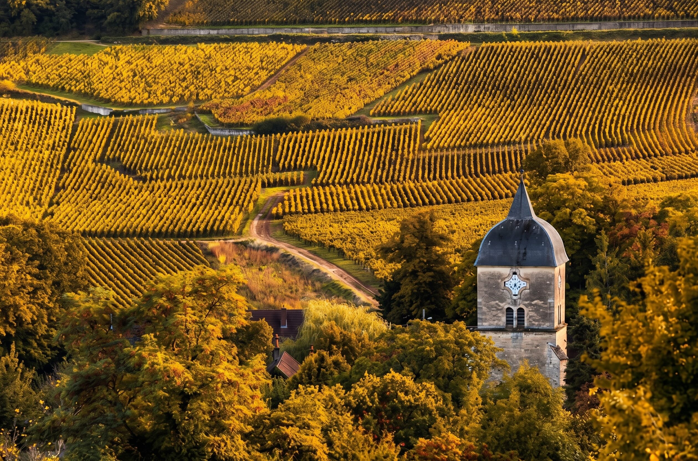

> 本文作者梅宁博，勃艮第葡萄酒专家、《勃艮第特级园》作者、《我爱勃艮第》系列视频作者。行程时间：2026年11月16日至21日，巴黎集合、巴黎解散。费用88000元/位，报名截止2026年10月10日，咨询微信 ningbovin。

品鉴了无数瓶勃艮第葡萄酒之后，你是否热切渴望踏上这片土地？

如果说五月的勃艮第是苏醒，那么十一月的勃艮第，是一年中最丰盛、也最热闹的时刻。

采收季结束，葡萄藤从翠绿变成一片金黄，晨雾贴着山坡缓缓流动，太阳升起后金丘（Côte d'Or）真正名副其实——整条山坡被点燃成一片黄金。酒农们从田里回到酒窖，新酒正在橡木桶里悄悄发酵，这是一年中最适合拜访酒庄的季节。

勃艮第葡萄酒反复强调"风土"两个字，它是用来站进去感受的。

Chablis的白垩土、Chambertin的铁锈红、Musigny那块斜坡上奇异的清凉、Montrachet面南的温暖……只有当你真正踏进这些葡萄园的那一刻，才能明白为什么同一个品种、相隔几十米，酿出的酒会如此不同。而在十一月，你还会多一重体验：跟着猎犬走进一片森林，亲手把一颗刚从土里挖出的勃艮第松露捧在掌心，闻到那股冬天特有的、无法翻译的香气。

11月16日，我们带你出发。

## 行程概要

| 项目 | 内容 |
|---|---|
| 时间 | 2026年11月16日－11月21日 |
| 集合与解散 | 11月16日巴黎汇合，11月21日返回巴黎 |
| 费用 | 人民币 88000 元／位 |
| 报名截止 | 2026年10月10日 |
| 报名方式 | 寻酿酒业，咨询微信 ningbovin |

## 行程特色

### 第一天（11月16日）巴黎－夏布利

从巴黎出发，抵达被称作勃艮第"金色大门"的Chablis地区。这里产的白葡萄酒是巴黎人的最爱，在花都大大小小的餐厅里，最常见的白葡萄酒就是Chablis。这里在大约1.5亿年前是海洋的一部分，今天或许你还能在葡萄园里发现一些海洋生物的化石。最神奇的是，那种令人兴奋的海洋味道也通过葡萄园传递到葡萄酒里。

当地的美食也特别值得称道，资深的老饕早就知道要去Chablis的几家美食餐厅打卡，不仅有意想不到的美食，酒单也常常有惊喜，尤其在这里可以试到一些Chablis的陈年老酒，为你打开一扇新的窗口。

我们将在Chablis拜访一家酒庄，欣赏初冬沿途的美景，晚上在当地一家传奇餐厅用餐。

### 第二天（11月17日）夜丘之旅 1/2

今天我们将探索Gevrey-Chambertin、Morey-St-Denis、Chambolle-Musigny和Vougeot的葡萄园和酒庄。我们从位于特级园之路上的Chambertin葡萄园开始：它是拿破仑的最爱，因此也被称为王者之酒。之后我们移步Morey-St-Denis，这里有很多宝藏，在法国著名的两家奢侈品公司LVMH和Kering在这里买入酒庄后，这个产区更是备受关注。随后我们会拜访一家酒庄，并在当地一家知名餐厅享用午餐。

Chambolle-Musigny可能是整个夜丘最美的村子，至少在我眼中是。单是读出"Musigny"的名字就让人产生很多美妙联想。我们将一起探索Musigny和爱侣园，以及不远处的伏旧园城堡：这里是勃艮第葡萄酒发扬光大的地方，你在里面可以看到修复后的中世纪酿造设备，当然还有古老的城堡本身，勃艮第大大小小的重要庆典都在这里举行。

拜访完伏旧园城堡，我们会访问一家知名的酒庄。晚餐我们将在当地的一家餐厅享用，并邀请庄主一起来一场主题晚宴。

### 第三天（11月18日）夜丘之旅 2/2 × 松露狩猎

今天我们的旅程从罗曼尼康帝葡萄园的十字架开始。Vosne-Romanée村每一块特级园的名字都能刺激人的肾上腺素加速分泌：Romanée-Conti、La Tâche、Richebourg、Romanée-St-Vivant。就更不用提来自这个村子的酒庄了。我们走近葡萄园一探究竟，随后一起拜访一家酒庄。

中午我们会在一家勃艮第膜拜级名庄开的餐厅用餐。

午后，本次行程的特别环节——松露狩猎。我们走进一片栎树林，主人带着训练多年的猎松露犬为我们引路。当猎犬在落叶间停下、开始刨土的那一刻，是这段旅程最令人屏息的画面之一。你将亲手挖出一颗还带着泥土与霜气的勃艮第松露，把它捧在掌心，闻到那股浓烈到近乎不真实的香气。狩猎结束后，是一场专为松露而设的品鉴：新鲜刨片的松露配上一款勃艮第，简单，却是这个季节独有的极致奢侈。

随后我们漫步于Nuits-St-Georges，这个村子在勃艮第葡萄酒贸易方面发挥着至关重要的作用，"夜丘"（Côte de Nuits）这个名字就来源于Nuits-St-Georges。晚上我们在当地的知名餐厅举办一场晚宴，或许会有神秘嘉宾的加入。

### 第四天（11月19日）伯恩丘之旅 1/2

早上我们将在Beaune小城醒来，这里是勃艮第葡萄酒的中心。漫步在小镇上，有种穿越到几个世纪前的感觉，这里彷佛一切都没有改变：市中心教堂的钟声、葡萄酒商店和书店来往的人群、餐厅、面包房、奶酪店和熟食店散发出的味道、甚至还有广场上的旋转木马，一切都那么梦幻，也那么真实。难怪这座人口仅有2.5万人的城市吸引着世界各地的勃艮第爱好者每年都来此朝拜。

用完早餐我们将出发前往Corton附近的山上，从山顶俯瞰山谷里的美景，中午在附近用餐。

下午我们将返回到Beaune，拜访一家当地酒商，加入他们的品鉴，并准备好晚上在一家地道的当地餐厅参加一场主题晚宴。如果足够早结束，还可以去当地知名的酒吧喝上一杯。

### 第五天（11月20日）伯恩丘之旅 2/2

今天我们来探索伯恩丘白葡萄酒的核心产区：Meursault、Puligny-Montrachet和Chassagne-Montrachet，在我眼中它们是全世界最棒的白葡萄酒产地，更不用说这几个村镇个个风景如画。漫步于Montrachet、Chevalier-Montrachet和Bâtard-Montrachet三块特级园之间，你立刻能感知到：哪怕是同一酒庄出品的三款特级园，口感差别的原因所在。

随后我们将拜访一家Puligny-Montrachet村的酒庄，并在附近享用午餐。

下午的时间我们用来探索Meursault村，这是一个把经典和创新体现得最淋漓尽致的产酒村：在这里你能品尝到勃艮第白葡萄酒的"古早味"，也能找到引领风潮最前沿的白葡萄酒风格。我们将拜访当地的一家酒庄。

晚上在勃艮第一家知名的米其林餐厅享用晚餐，这里的美食和丰富的酒单会让你度过一个陶醉的夜晚。

### 第六天（11月21日）第戎－巴黎

在Beaune睡个懒觉，或者沿着小镇晨跑、漫步……一顿丰盛的早午餐之后，启程前往巴黎。或许当天会有意外的惊喜。

## 与谁同游

梅宁博，勃艮第葡萄酒专家、《勃艮第特级园》作者、《我爱勃艮第》系列视频作者。与 Jasper Morris MW 联合创办 Inside Burgundy 中文版并任主编。自 2011 年起每年赴勃艮第实地考察，累计走访酒庄逾 500 家，为中国藏家主持勃艮第深度考察与高阶品鉴课程。

## 适合人群

这是一场专为热爱风土、追求极致品味的灵魂而设的旅程。你或许会在以下描述中找到自己：

- **葡萄酒爱好者与收藏家**：希望系统深入理解勃艮第风土、酒庄与年份风格；
- **高净值旅行者与生活方式探索者**：偏爱文化厚重、节奏舒缓且沉浸式的高端旅程；
- **品牌主理人／内容创作者／KOL**：寻找能激发灵感与品味叙事的新素材；
- **Inside Burgundy 或 WSET 学习者**：渴望将书本知识转化为实地体验，加深理解。

无需是葡萄酒专家，但你一定要有一颗对"时间与土地"的敬畏之心。

## 常见问题

### 这次旅程是自由行还是跟团？

这是一场小规模高密度的定制式深度旅行，非传统跟团模式。由专业领队与讲师带队，行程内容围绕"产区风土 + 名庄体验 + 高端美食"展开。

### 需要葡萄酒知识基础吗？

无需专业背景，但建议对葡萄酒，尤其是勃艮第葡萄酒有一定兴趣。行程中会通过讲解与实地体验帮助你快速建立理解。

### 行程会去到哪些酒庄？

勃艮第的大部分酒庄（尤其是名庄）是不接受公开参观的，因此我们不能提前预知能参观哪些酒庄。确定成行后，我们会尽全力安排一些有代表性的知名酒庄。您提早确定报名，会非常有助于我们的行程安排。

### 松露狩猎具体是怎样的安排？

我们进入一片私人栎树林，由专业采松露人带着受训猎犬带队，全程可参与、可拍摄。随后有专门的松露品鉴环节。松露为当季自然产物，具体收获会因天气与土地情况略有不同。

### 餐饮是否包含在内？酒水如何安排？

所有行程内用餐已包含，搭配酒款均为精心遴选的优质勃艮第佳酿，包括陈年酒款与限量特级园。部分高端餐厅设有丰富酒单自由选择机会（额外点单费用自理）。

### 每天的行程强度高吗？

整体节奏舒适。每日安排在2-3家酒庄参访、美食体验与适度自由时间之间切换。少量葡萄园与松露林徒步以观景与体验为主，身体健康状况正常者均可胜任。

### 房间是单间吗？

是的，双人报名自动升级大床房或套房。

### 费用是否含往返国际机票？

费用不含国际段机票与签证办理，需自行前往集合地（巴黎）。我们可协助提供航班与签证建议。

### 报名后若临时无法参加怎么办？

本行程支持转让，不支持退款。如临时不能成行，可将名额转让给朋友或亲属。若因不可抗力或未成团取消，将全额退款。

### 我可以拍照或拍视频分享吗？

欢迎记录并分享你的旅程，我们鼓励你用影像讲述属于你自己的勃艮第故事。但请在酒庄内遵守拍摄礼仪。

## 行程费用

人民币 88000 元／位。咨询请加微信：**ningbovin**

**费用包含**

- 所有行程内餐费和酒水费用
- 行程内主题晚宴费用（含庄主参与）
- 松露狩猎体验及松露品鉴
- 行程内交通
- 行程内酒店
- 葡萄园及酒庄参观
- 境外保险

**费用不含**

- 往返法国机票费用
- 签证费用
- 行程外用餐费用
- 行程中额外单点餐费和酒水费用
- 餐厅及酒店小费

## 特别提醒

本次行程为会议性质，本司提供行程策划、信息服务，及旅游产品代订服务。

行程中预约的酒庄、餐厅及酒店可能存在变化，以实际到访为准，本单位保留最终解释权。

取消条款：确认报名后可转让，不可退款，若遇不可抗力或未成团造成的行程取消，全额退款。报名即意味您已同意上述条款。
